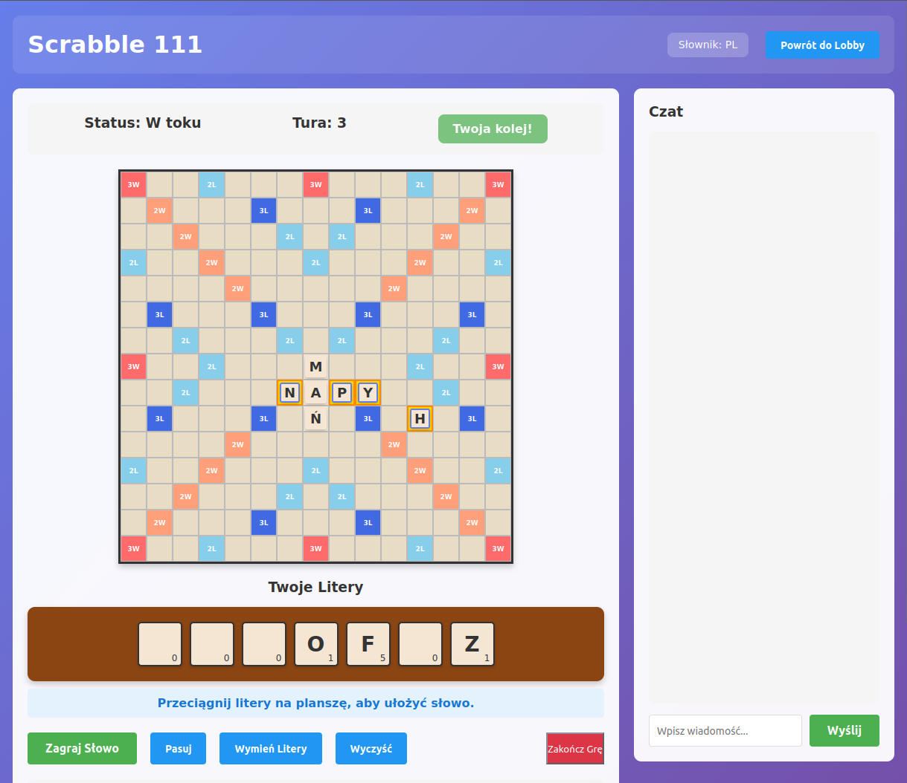
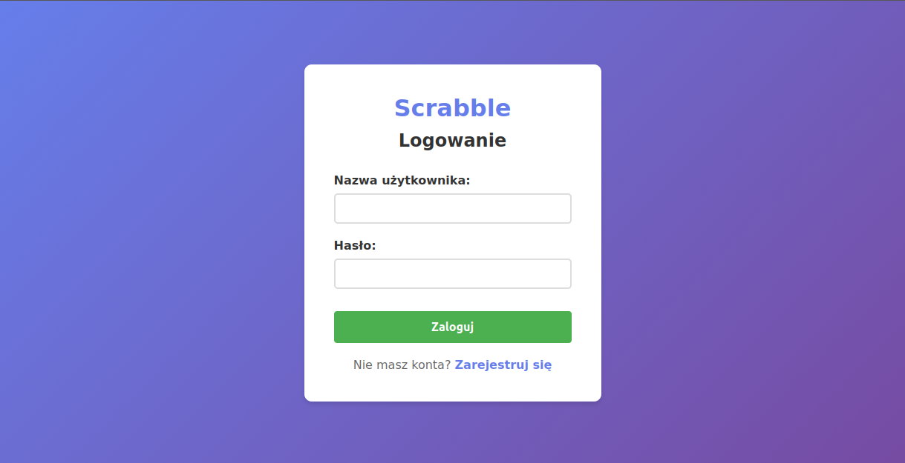
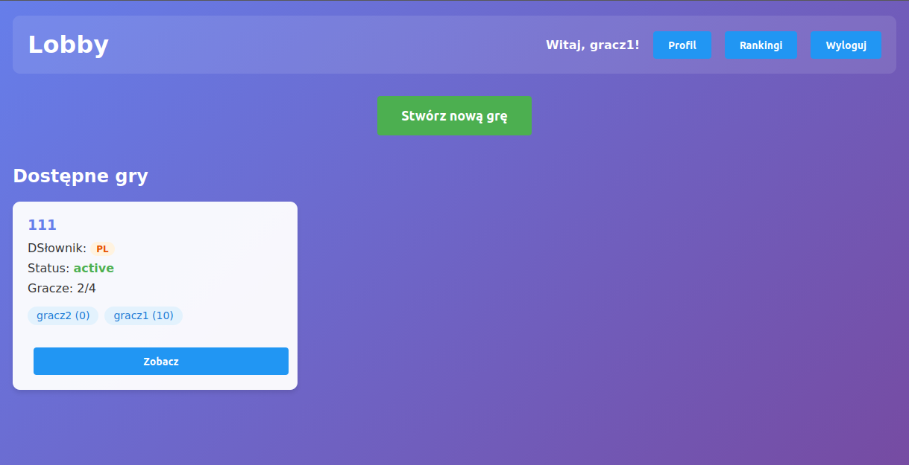
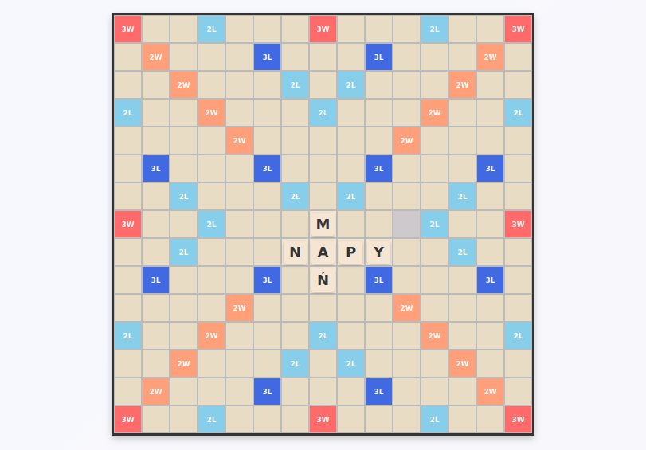
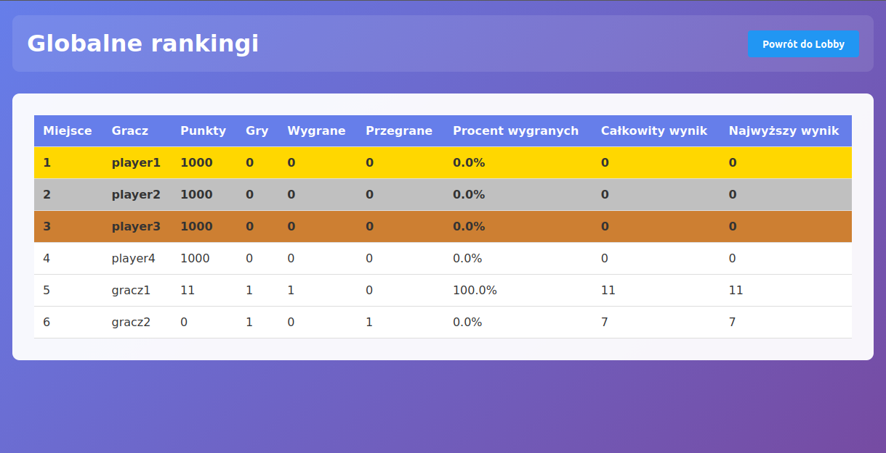

# 🎮 Scrabble Online

Wieloosobowa gra Scrabble dostępna w przeglądarce. Graj z przyjaciółmi w czasie rzeczywistym!


<!-- Dodaj screenshot planszy gry do folderu /img -->

## ✨ Funkcjonalności

- Pełna rozgrywka Scrabble dla 2-4 graczy
- Polski i angielski słownik
- Intuicyjny interfejs drag-and-drop
- Czat w czasie rzeczywistym
- System rankingowy i statystyki

## 🚀 Szybki Start

### Wymagania
- [Docker](https://docs.docker.com/get-docker/)
- [Docker Compose](https://docs.docker.com/compose/install/)

### Instalacja i uruchomienie

```bash
# Sklonuj repozytorium
git clone https://github.com/ziomson-pl/PAINT_Dulikowska_Kowalski_Wroblewski_Scrabble.git
cd PAINT_Dulikowska_Kowalski_Wroblewski_Scrabble

# Uruchom aplikację
docker compose up --build
```

Po uruchomieniu aplikacja będzie dostępna pod adresami:
- **Frontend:** http://localhost:3000
- **Backend API:** http://localhost:8000
- **API Docs:** http://localhost:8000/docs

### Konta testowe
| Login | Hasło |
|-------|-------|
| player1 | password123 |
| player2 | password123 |
| player3 | password123 |
| player4 | password123 |

## 📸 Zrzuty ekranu

<table>
  <tr>
    <td></td>
    <td></td>
  </tr>
  <tr>
    <td align="center"><em>Ekran logowania</em></td>
    <td align="center"><em>Lobby z listą gier</em></td>
  </tr>
  <tr>
    <td></td>
    <td></td>
  </tr>
  <tr>
    <td align="center"><em>Plansza gry</em></td>
    <td align="center"><em>Tabela rankingowa</em></td>
  </tr>
</table>
<!-- Dodaj screenshoty do folderu /img -->

## 🛠️ Architektura

| Warstwa | Technologia |
|---------|-------------|
| Frontend | React 19, Vite, @dnd-kit |
| Backend | FastAPI, SQLAlchemy |
| Baza danych | PostgreSQL 15 |
| Konteneryzacja | Docker, Docker Compose |

## 📚 Dokumentacja

Szczegółowa dokumentacja techniczna:

-  [**Backend**](docs/BACKEND.md) — API, modele, serwisy, autentykacja
- [**Frontend**](docs/FRONTEND.md) — komponenty React, routing, UI
- [**Baza danych**](docs/DATABASE.md) — schemat tabel, relacje, ERD

## 👥 Autorzy

Projekt PAINT — Politechnika Warszawska

- Małgorzata Dulikowska
- Tomasz Kowalski  
- Jakub Wróblewski

## 📄 Licencja

Projekt edukacyjny.
