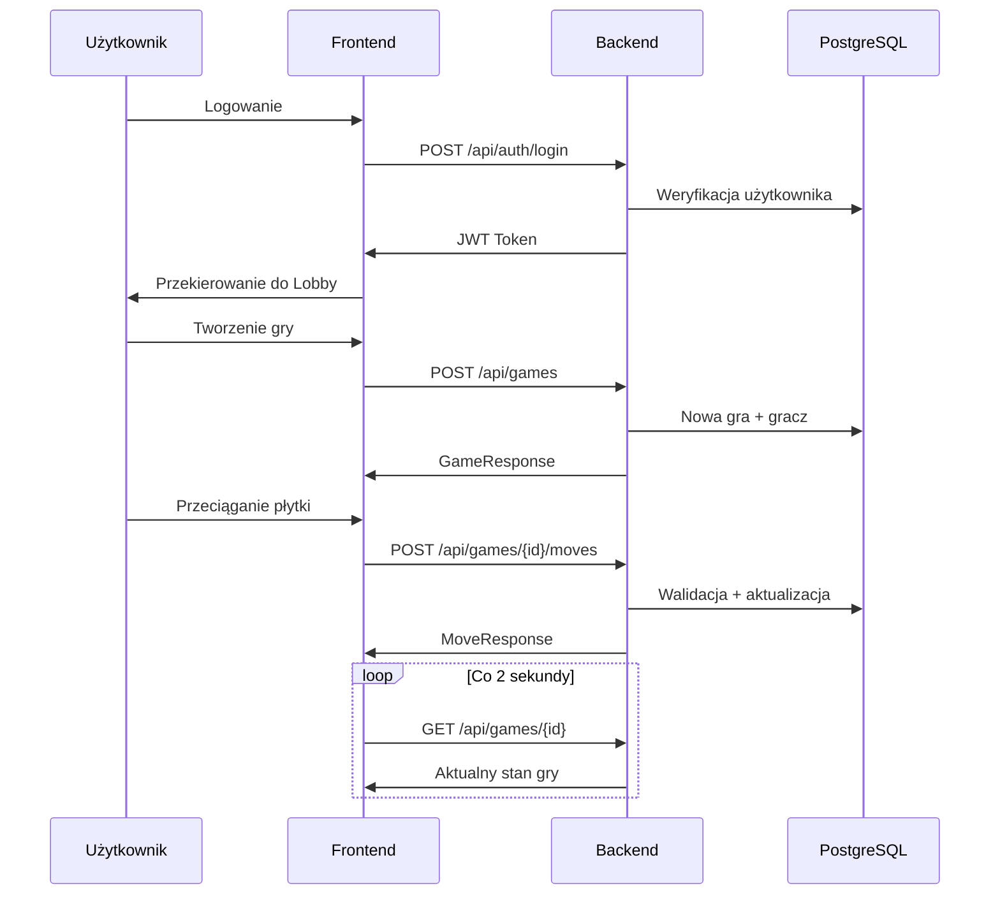

# Dokumentacja Backendu - Scrabble

## Przegląd

Backend aplikacji Scrabble jest zbudowany w oparciu o **FastAPI** (Python). Odpowiada za całą logikę biznesową gry, autentykację użytkowników, zarządzanie grami, czat w czasie rzeczywistym oraz komunikację z bazą danych PostgreSQL.

---

## Struktura Katalogów

```
backend/
├── main.py                 # Główny plik aplikacji FastAPI
├── database.py             # Konfiguracja połączenia z bazą danych
├── seed_database.py        # Skrypt do inicjalizacji bazy danych
├── requirements.txt        # Zależności Python
├── Dockerfile              # Konfiguracja kontenera Docker
├── slownik.txt             # Polski słownik (~45MB, ~2.9M słów)
├── dictionary.txt          # Angielski słownik (~1.7MB)
└── app/
    ├── __init__.py
    ├── auth.py             # Logika autentykacji (JWT, bcrypt)
    ├── models.py           # Modele SQLAlchemy (ORM)
    ├── schemas.py          # Schematy Pydantic (walidacja danych)
    ├── routes/
    │   ├── __init__.py
    │   ├── auth.py         # Endpointy rejestracji i logowania
    │   ├── games.py        # Endpointy zarządzania grami
    │   ├── chat.py         # WebSocket czatu w grze
    │   └── profile.py      # Endpointy profilu i rankingów
    └── services/
        ├── __init__.py
        ├── game_service.py     # Logika gry Scrabble
        └── ranking_service.py  # Aktualizacja statystyk graczy
```

---

## Główna Aplikacja (`main.py`)

### Konfiguracja
- **Tytuł API**: `Scrabble Game API`
- **Wersja**: `1.0.0`
- **CORS**: Dozwolone pochodzenia: `http://localhost:3000`, `http://frontend:3000`

### Zarejestrowane Routery
| Prefix | Moduł | Opis |
|--------|-------|------|
| `/api/auth` | `auth.router` | Autentykacja użytkowników |
| `/api/games` | `games.routes` | Zarządzanie grami |
| `/api` | `profile.routes` | Profil i rankingi |
| `/ws/chat` | `chat.routes` | WebSocket czatu |

### Endpointy Systemowe
| Metoda | Ścieżka | Opis |
|--------|---------|------|
| `GET` | `/` | Informacje o API |
| `GET` | `/health` | Sprawdzenie stanu serwera |

---

## Uwierzytelnienie (`app/auth.py`)

### Technologie
- **JWT (JSON Web Tokens)** - biblioteka `python-jose`
- **Hashowanie haseł** - `bcrypt` przez `passlib`

### Konfiguracja (zmienne środowiskowe)
| Zmienna | Wartość domyślna | Opis |
|---------|------------------|------|
| `SECRET_KEY` | `your-secret-key-change-in-production` | Klucz do podpisywania tokenów |
| `ALGORITHM` | `HS256` | Algorytm podpisu JWT |
| `ACCESS_TOKEN_EXPIRE_MINUTES` | `30` | Czas ważności tokenu (minuty) |

### Funkcje
| Funkcja | Opis |
|---------|------|
| `verify_password(plain, hashed)` | Weryfikacja hasła |
| `get_password_hash(password)` | Hashowanie hasła bcrypt |
| `create_access_token(data, expires_delta)` | Tworzenie tokenu JWT |
| `authenticate_user(db, username, password)` | Autentykacja użytkownika |
| `get_current_user(token, db)` | Dependency - pobieranie zalogowanego użytkownika |

---

## Modele Bazy Danych (`app/models.py`)

Plik zawiera modele tabel odpowiadające bazie danych.

## API Endpointy (`/routes/auth.py`)

### Autentykacja (`/api/auth`)

| Metoda | Ścieżka | Request Body | Response | Opis |
|--------|---------|--------------|----------|------|
| `POST` | `/api/auth/register` | `UserCreate` | `UserResponse` | Rejestracja nowego użytkownika |
| `POST` | `/api/auth/login` | `UserLogin` | `Token` | Logowanie (zwraca JWT) |

#### Schemat UserCreate
```json
{
  "username": "string (3-50 znaków)",
  "email": "string (valid email)",
  "password": "string (min 6 znaków)"
}
```

#### Schemat Token
```json
{
  "access_token": "string (JWT)",
  "token_type": "bearer"
}
```

---

### Gry (`/api/games`)

Wszystkie endpointy wymagają nagłówka: `Authorization: Bearer <token>`

| Metoda | Ścieżka | Request Body | Response | Opis |
|--------|---------|--------------|----------|------|
| `POST` | `/api/games` | `GameCreate` | `GameResponse` | Tworzenie nowej gry |
| `GET` | `/api/games` | - | `List[GameResponse]` | Lista dostępnych gier |
| `GET` | `/api/games/{id}` | - | `GameDetailResponse` | Szczegóły gry (z rack) |
| `POST` | `/api/games/{id}/join` | - | `{message, player_order}` | Dołączenie do gry |
| `POST` | `/api/games/{id}/start` | - | `{message}` | Rozpoczęcie gry |
| `POST` | `/api/games/{id}/moves` | `MoveCreate` | `MoveResponse` | Wykonanie ruchu |
| `GET` | `/api/games/{id}/moves` | - | `List[MoveResponse]` | Historia ruchów |
| `POST` | `/api/games/{id}/end` | - | `{message}` | Zakończenie gry |

#### Schemat GameCreate
```json
{
  "game_name": "string (opcjonalne, max 100)",
  "dictionary": "PL | EN"
}
```

#### Schemat MoveCreate
```json
{
  "tiles": [
    {"letter": "A", "row": 7, "col": 7, "is_blank": false}
  ],
  "is_pass": false,
  "is_exchange": false,
  "exchange_tiles": ["A", "B"]  // tylko gdy is_exchange=true
}
```

---

### Profil i Rankingi (`/api`)

| Metoda | Ścieżka | Response | Opis |
|--------|---------|----------|------|
| `GET` | `/api/profile` | `UserResponse` | Profil zalogowanego użytkownika |
| `GET` | `/api/rankings` | `List[RankingResponse]` | Top 100 graczy |
| `GET` | `/api/history` | `List[GameHistoryResponse]` | Historia gier użytkownika |

---

### Czat (WebSocket)

| Ścieżka | Opis |
|---------|------|
| `ws://backend:8000/ws/chat/{game_id}` | Połączenie WebSocket do czatu gry |

#### Format Wiadomości (wysyłana)
```json
{
  "username": "string",
  "user_id": 123,
  "message": "Cześć wszystkim!"
}
```

#### Format Wiadomości (odbierana)
```json
{
  "id": 1,
  "user_id": 123,
  "username": "player1",
  "message": "Cześć wszystkim!",
  "created_at": "2024-01-15T10:30:00"
}
```

| Metoda | Ścieżka | Response | Opis |
|--------|---------|----------|------|
| `GET` | `/api/games/{id}/messages` | `List[ChatMessage]` | Historia czatu gry |

---

## Serwis Gry (`app/services/game_service.py`)

### Dystrybucja Płytek - Polski Scrabble (100 płytek)

| Litera | Ilość | Punkty | Litera | Ilość | Punkty |
|--------|-------|--------|--------|-------|--------|
| A | 9 | 1 | Ł | 2 | 3 |
| I | 8 | 1 | G | 2 | 3 |
| E | 7 | 1 | B | 2 | 3 |
| O | 6 | 1 | H | 2 | 3 |
| Z | 5 | 1 | Ą | 1 | 5 |
| N | 5 | 1 | Ę | 1 | 5 |
| R | 4 | 1 | F | 1 | 5 |
| W | 4 | 1 | Ś | 1 | 5 |
| S | 4 | 1 | Ż | 1 | 5 |
| Y | 4 | 2 | Ó | 1 | 5 |
| C | 3 | 2 | Ć | 1 | 6 |
| T | 3 | 2 | Ń | 1 | 7 |
| K | 3 | 2 | Ź | 1 | 9 |
| D | 3 | 2 | _ (blank) | 2 | 0 |
| P | 3 | 2 |
| M | 3 | 2 |
| U | 2 | 3 |
| J | 2 | 3 |
| L | 3 | 2 |

### Pola Premium na Planszy (15x15)

| Typ | Klasa CSS | Pozycje |
|-----|-----------|---------|
| **Triple Word (3x słowo)** | `triple-word` | (0,0), (0,7), (0,14), (7,0), (7,14), (14,0), (14,7), (14,14) |
| **Double Word (2x słowo)** | `double-word` | Układ diagonalny od rogów |
| **Triple Letter (3x litera)** | `triple-letter` | 12 pozycji rozrzuconych |
| **Double Letter (2x litera)** | `double-letter` | 24 pozycje |
| **Środek** | `center-star` | (7,7) - gwiazdka ★ |

### Funkcje Serwisu

| Metoda | Opis |
|--------|------|
| `create_game(game_name, dictionary)` | Tworzenie nowej gry z pustą planszą i pełnym workiem |
| `join_game(game_id, user_id)` | Dołączenie gracza (max 4 graczy) |
| `start_game(game_id)` | Rozpoczęcie gry (min 2 graczy) |
| `end_game(game_id, user_id)` | Zakończenie gry i aktualizacja rankingów |
| `make_move(game_id, user_id, tiles, is_pass, is_exchange, exchange_tiles)` | Wykonanie ruchu |

### Logika Ruchu

1. **Walidacja gracza** - sprawdzenie czy to jego tura
2. **Walidacja płytek** - czy gracz ma te płytki w rack
3. **Umieszczenie na planszy** - sprawdzenie czy pola są wolne
4. **Walidacja pierwszego ruchu** - musi przechodzić przez środek (7,7)
5. **Znajdowanie słów** - `_find_words()` - wszystkie utworzone słowa
6. **Walidacja słów** - `_is_valid_word()` - sprawdzenie w słowniku
7. **Kalkulacja punktów** - `_calculate_score()` - z uwzględnieniem pól premium
8. **Aktualizacja stanu** - plansza, rack gracza, worek, wynik
9. **Bonus 50 punktów** - za użycie wszystkich 7 płytek

### Walidacja Słów z Blankami

Blanki (`_`) są traktowane jako wildcards. System używa wyrażeń regularnych do dopasowania słów ze słownika.

---

## Serwis Rankingowy (`app/services/ranking_service.py`)

### Formuła Rankingu
```python
rating = total_score * wins / total_games
```

---

## Inicjalizacja Bazy Danych (`seed_database.py`)

Skrypt automatycznie uruchamiany przy starcie kontenera.

### Kroki
1. Oczekiwanie na gotowość bazy (max 30 prób, co 2s)
2. Tworzenie tabel SQLAlchemy
3. Ładowanie słowników (PostgreSQL COPY command dla szybkości)
4. Tworzenie testowych użytkowników

### Użytkownicy Testowi
| Username | Email | Hasło |
|----------|-------|-------|
| player1 | player1@example.com | password123 |
| player2 | player2@example.com | password123 |
| player3 | player3@example.com | password123 |
| player4 | player4@example.com | password123 |

---

## Zależności

Obecne w pliku `requirements.txt`.

---

## Docker

### Dockerfile
```dockerfile
FROM python:3.11-slim
WORKDIR /app
COPY requirements.txt .
RUN pip install --no-cache-dir -r requirements.txt
COPY . .
EXPOSE 8000
```

### Zmienne Środowiskowe
```yaml
DATABASE_URL: postgresql://scrabble_user:scrabble_pass@db:5432/scrabble
SECRET_KEY: your-secret-key-change-in-production
ALGORITHM: HS256
ACCESS_TOKEN_EXPIRE_MINUTES: 30
```

### Komenda Startowa
```bash
python seed_database.py && uvicorn main:app --host 0.0.0.0 --port 8000 --reload
```

---

## Przepływ Gry



---

## Obsługa Błędów

| Kod | Opis |
|-----|------|
| 400 | Nieprawidłowe dane wejściowe / błąd logiki gry |
| 401 | Brak autoryzacji / nieprawidłowy token |
| 403 | Nie w tej grze |
| 404 | Gra nieznaleziona |
| 500 | Błąd serwera |

### Przykładowe Komunikaty Błędów
- `"Not your turn"` - nie twoja tura
- `"Invalid word: XYZ"` - słowo nie istnieje w słowniku
- `"First move must go through the center square (7,7)"` - pierwszy ruch musi przechodzić przez środek
- `"Not enough X tiles in rack"` - brak wystarczających płytek
