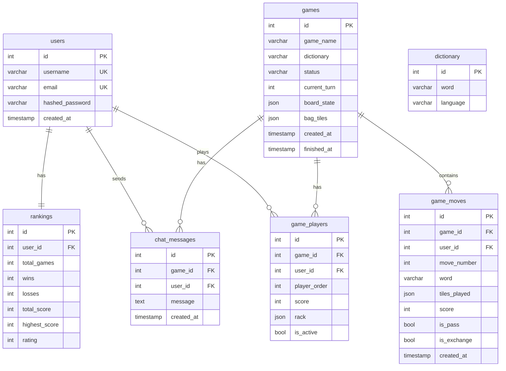

# Dokumentacja Bazy Danych - Scrabble

## Przegląd

Aplikacja używa **PostgreSQL 15** jako bazy danych. ORM: **SQLAlchemy 2.0**.

## Konfiguracja

### Docker Compose
```yaml
db:
  image: postgres:15-alpine
  container_name: scrabble_db
  environment:
    POSTGRES_DB: scrabble
    POSTGRES_USER: scrabble_user
    POSTGRES_PASSWORD: scrabble_pass
  ports:
    - "5432:5432"
  volumes:
    - postgres_data:/var/lib/postgresql/data
```

### Connection String
```
postgresql://scrabble_user:scrabble_pass@db:5432/scrabble
```

---

## Diagram ERD



---

## Inicjalizacja (seed_database.py)

Skrypt uruchamiany automatycznie przy starcie backendu.

### Kroki
1. Oczekiwanie na bazę (30 prób × 2s)
2. Tworzenie tabel (SQLAlchemy)
3. Ładowanie słowników (PostgreSQL COPY)
4. Tworzenie użytkowników testowych

### Użytkownicy Testowi
| Username | Email | Hasło |
|----------|-------|-------|
| player1 | player1@example.com | password123 |
| player2 | player2@example.com | password123 |
| player3 | player3@example.com | password123 |
| player4 | player4@example.com | password123 |

---

## Relacje

| Tabela nadrzędna | Tabela podrzędna | Relacja | ON DELETE |
|------------------|------------------|---------|-----------|
| users | game_players | 1:N | CASCADE |
| users | rankings | 1:1 | CASCADE |
| users | chat_messages | 1:N | CASCADE |
| games | game_players | 1:N | CASCADE |
| games | game_moves | 1:N | CASCADE |
| games | chat_messages | 1:N | CASCADE |

---


## Backup i Restore

### Backup
```bash
docker exec scrabble_db pg_dump -U scrabble_user scrabble > backup.sql
```

### Restore
```bash
cat backup.sql | docker exec -i scrabble_db psql -U scrabble_user scrabble
```

---

## Healthcheck

```yaml
healthcheck:
  test: ["CMD-SHELL", "pg_isready -U scrabble_user -d scrabble"]
  interval: 10s
  timeout: 5s
  retries: 5
```
