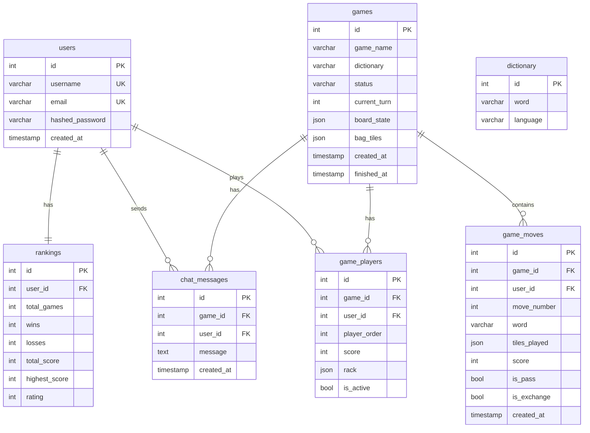

# Dokumentacja Bazy Danych - Scrabble

## Przegląd

Aplikacja używa **PostgreSQL 15** jako bazy danych. ORM: **SQLAlchemy 2.0**.

## Konfiguracja

### Docker Compose
```yaml
db:
  image: postgres:15-alpine
  container_name: scrabble_db
  environment:
    POSTGRES_DB: scrabble
    POSTGRES_USER: scrabble_user
    POSTGRES_PASSWORD: scrabble_pass
  ports:
    - "5432:5432"
  volumes:
    - postgres_data:/var/lib/postgresql/data
```

### Connection String
```
postgresql://scrabble_user:scrabble_pass@db:5432/scrabble
```

---

## Diagram ERD



---

## Tabele

### users
Przechowuje dane użytkowników.

| Kolumna | Typ | Ograniczenia | Opis |
|---------|-----|--------------|------|
| id | INTEGER | PK, AUTO | Identyfikator |
| username | VARCHAR(50) | UNIQUE, NOT NULL | Nazwa użytkownika |
| email | VARCHAR(100) | UNIQUE, NOT NULL | Email |
| hashed_password | VARCHAR(255) | NOT NULL | Hash hasła (bcrypt) |
| created_at | TIMESTAMP | DEFAULT NOW() | Data rejestracji |

**Indeksy:** `username`, `email`

---

### games
Przechowuje informacje o grach.

| Kolumna | Typ | Ograniczenia | Opis |
|---------|-----|--------------|------|
| id | INTEGER | PK, AUTO | Identyfikator |
| game_name | VARCHAR(100) | NULL | Opcjonalna nazwa |
| dictionary | VARCHAR(10) | DEFAULT 'PL' | "PL" lub "EN" |
| status | VARCHAR(20) | DEFAULT 'waiting' | Status gry |
| current_turn | INTEGER | DEFAULT 0 | Numer tury |
| board_state | JSON | NULL | Stan planszy 15x15 |
| bag_tiles | JSON | NULL | Pozostałe płytki |
| created_at | TIMESTAMP | DEFAULT NOW() | Data utworzenia |
| finished_at | TIMESTAMP | NULL | Data zakończenia |

**Statusy:** `waiting`, `active`, `finished`

**Struktura board_state:**
```json
[
  [null, null, {"letter": "A", "is_blank": false}, ...],  // row 0
  [...],  // row 1
  ...     // rows 2-14
]
```

---

### game_players
Powiązanie graczy z grami.

| Kolumna | Typ | Ograniczenia | Opis |
|---------|-----|--------------|------|
| id | INTEGER | PK, AUTO | Identyfikator |
| game_id | INTEGER | FK(games.id), NOT NULL | Gra |
| user_id | INTEGER | FK(users.id), NOT NULL | Gracz |
| player_order | INTEGER | NOT NULL | Kolejność (0-3) |
| score | INTEGER | DEFAULT 0 | Wynik |
| rack | JSON | NULL | Płytki gracza (7) |
| is_active | BOOLEAN | DEFAULT TRUE | Czy aktywny |

**Struktura rack:**
```json
["A", "B", "C", "D", "E", "F", "G"]
```

---

### game_moves
Historia ruchów w grze.

| Kolumna | Typ | Ograniczenia | Opis |
|---------|-----|--------------|------|
| id | INTEGER | PK, AUTO | Identyfikator |
| game_id | INTEGER | FK(games.id), NOT NULL | Gra |
| user_id | INTEGER | FK(users.id), NOT NULL | Gracz |
| move_number | INTEGER | NOT NULL | Numer ruchu |
| word | VARCHAR(15) | NULL | Utworzone słowo |
| tiles_played | JSON | NULL | Zagrane płytki |
| score | INTEGER | DEFAULT 0 | Punkty |
| is_pass | BOOLEAN | DEFAULT FALSE | Czy pas |
| is_exchange | BOOLEAN | DEFAULT FALSE | Czy wymiana |
| created_at | TIMESTAMP | DEFAULT NOW() | Czas ruchu |

**Struktura tiles_played:**
```json
[
  {"letter": "K", "row": 7, "col": 7, "is_blank": false},
  {"letter": "O", "row": 7, "col": 8, "is_blank": false},
  {"letter": "T", "row": 7, "col": 9, "is_blank": false}
]
```

---

### dictionary
Słowniki do walidacji słów.

| Kolumna | Typ | Ograniczenia | Opis |
|---------|-----|--------------|------|
| id | INTEGER | PK, AUTO | Identyfikator |
| word | VARCHAR(50) | NOT NULL | Słowo (UPPERCASE) |
| language | VARCHAR(10) | DEFAULT 'PL' | Język |

**Constraint:** UNIQUE(word, language)

**Statystyki:**
- Polski: ~2.9 miliona słów (45MB)
- Angielski: ~170 tysięcy słów (1.7MB)

---

### rankings
Statystyki i rankingi graczy.

| Kolumna | Typ | Ograniczenia | Opis |
|---------|-----|--------------|------|
| id | INTEGER | PK, AUTO | Identyfikator |
| user_id | INTEGER | FK(users.id), UNIQUE | Gracz |
| total_games | INTEGER | DEFAULT 0 | Łączna liczba gier |
| wins | INTEGER | DEFAULT 0 | Wygrane |
| losses | INTEGER | DEFAULT 0 | Przegrane |
| total_score | INTEGER | DEFAULT 0 | Suma punktów |
| highest_score | INTEGER | DEFAULT 0 | Rekord |
| rating | INTEGER | DEFAULT 1000 | Ranking |

**Formuła ratingu:**
```python
rating = total_score * wins / total_games
```

---

### chat_messages
Wiadomości czatu w grach.

| Kolumna | Typ | Ograniczenia | Opis |
|---------|-----|--------------|------|
| id | INTEGER | PK, AUTO | Identyfikator |
| game_id | INTEGER | FK(games.id), NOT NULL | Gra |
| user_id | INTEGER | FK(users.id), NOT NULL | Autor |
| message | TEXT | NOT NULL | Treść |
| created_at | TIMESTAMP | DEFAULT NOW() | Czas |

---

## Inicjalizacja (seed_database.py)

Skrypt uruchamiany automatycznie przy starcie backendu.

### Kroki
1. Oczekiwanie na bazę (30 prób × 2s)
2. Tworzenie tabel (SQLAlchemy)
3. Ładowanie słowników (PostgreSQL COPY)
4. Tworzenie użytkowników testowych

### Użytkownicy Testowi
| Username | Email | Hasło |
|----------|-------|-------|
| player1 | player1@example.com | password123 |
| player2 | player2@example.com | password123 |
| player3 | player3@example.com | password123 |
| player4 | player4@example.com | password123 |

---

## Relacje

| Tabela nadrzędna | Tabela podrzędna | Relacja | ON DELETE |
|------------------|------------------|---------|-----------|
| users | game_players | 1:N | CASCADE |
| users | rankings | 1:1 | CASCADE |
| users | chat_messages | 1:N | CASCADE |
| games | game_players | 1:N | CASCADE |
| games | game_moves | 1:N | CASCADE |
| games | chat_messages | 1:N | CASCADE |

---

## Przykładowe Zapytania

### Lista aktywnych gier
```sql
SELECT * FROM games 
WHERE status IN ('waiting', 'active');
```

### Ranking top 10
```sql
SELECT u.username, r.rating, r.wins, r.total_games
FROM rankings r
JOIN users u ON r.user_id = u.id
ORDER BY r.rating DESC
LIMIT 10;
```

### Historia ruchów gracza
```sql
SELECT gm.word, gm.score, gm.created_at
FROM game_moves gm
WHERE gm.user_id = 1 AND gm.word IS NOT NULL
ORDER BY gm.created_at DESC;
```

### Walidacja słowa
```sql
SELECT EXISTS(
  SELECT 1 FROM dictionary 
  WHERE word = 'KOT' AND language = 'PL'
);
```

---

## Backup i Restore

### Backup
```bash
docker exec scrabble_db pg_dump -U scrabble_user scrabble > backup.sql
```

### Restore
```bash
cat backup.sql | docker exec -i scrabble_db psql -U scrabble_user scrabble
```

---

## Healthcheck

```yaml
healthcheck:
  test: ["CMD-SHELL", "pg_isready -U scrabble_user -d scrabble"]
  interval: 10s
  timeout: 5s
  retries: 5
```
